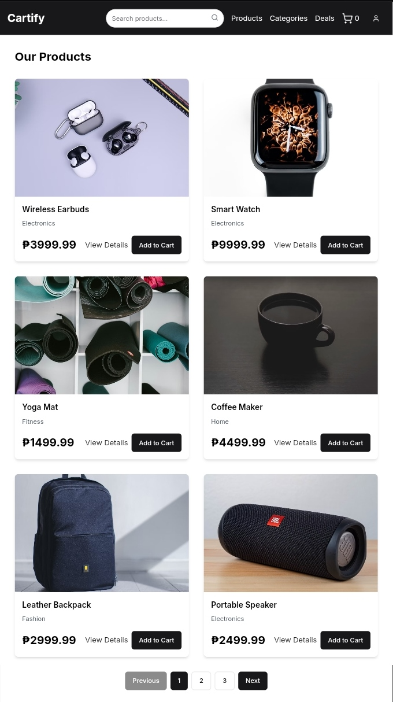
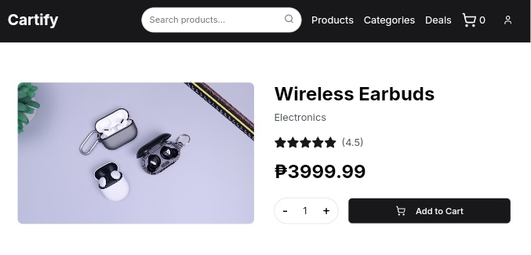
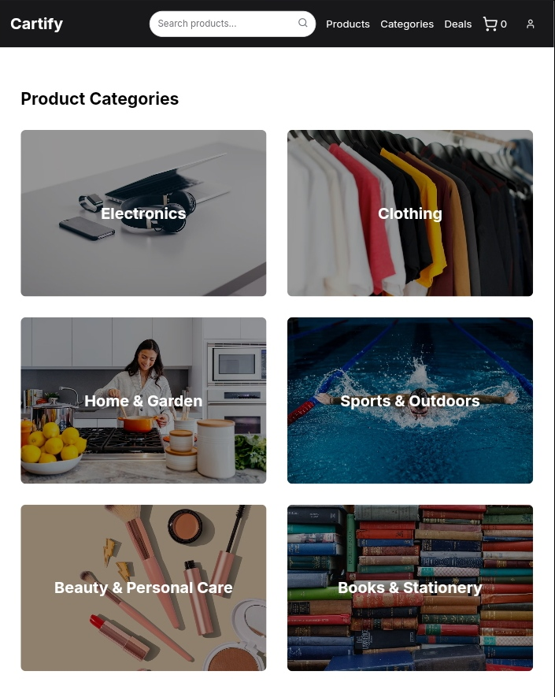
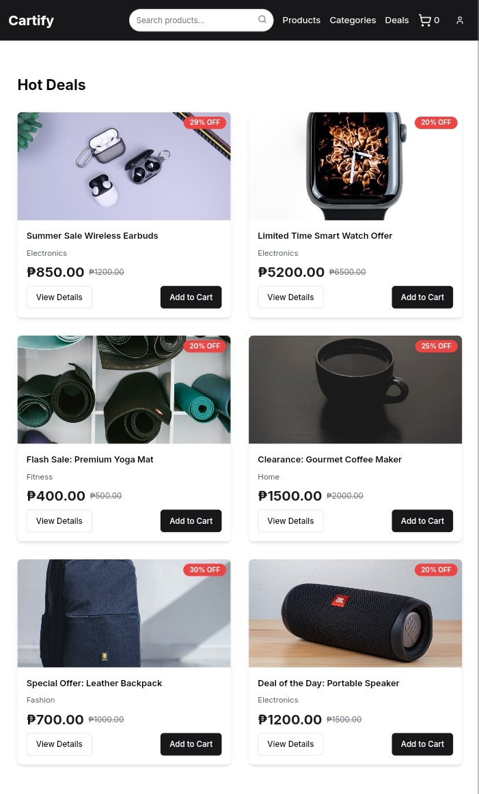
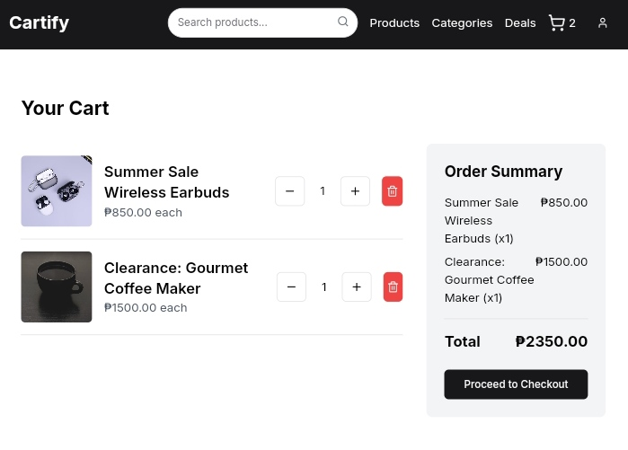
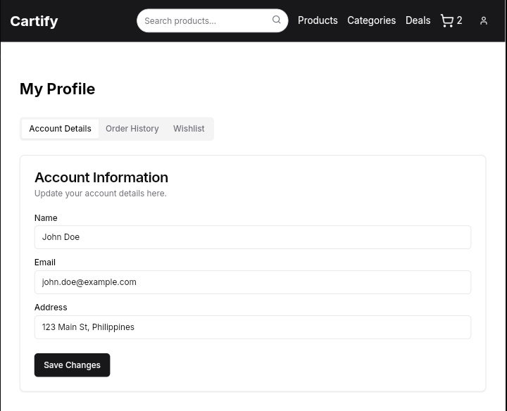
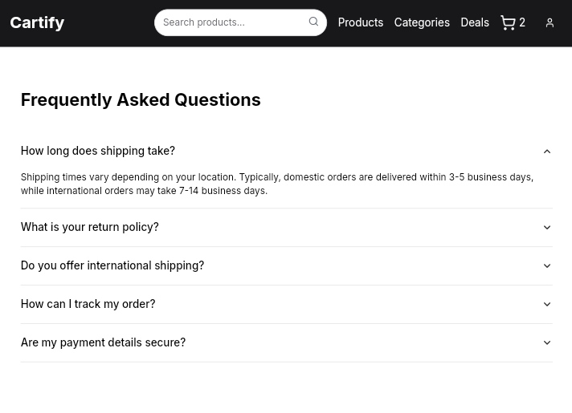

# Cartify - E-commerce Platform

Cartify is an e-commerce platform built with Next.js, React, and TypeScript.

## Features

- Product listing with search and filter capabilities
- Product pages
- Shopping cart functionality
- Checkout process
- User profiles and order history
- Deals and promotions page
- Category-based product browsing
- Toast notifications for user actions
- **Wishlist** functionality to save favorite products
- **Order** tracking for users to view past purchases
- **Login** and **Logout** functionality for user authentication
- **About**, **Contact**, and **Shipping** pages for customer information
- **Returns** and **Privacy Policy** pages to ensure transparency and trust

## Products

## Product Details

## Product Categories

## Hot Deals

## Cart

## Profile

## FAQ

## Tech Stack

- [Next.js](https://nextjs.org/) - React framework for server-side rendering and static site generation
- [React](https://reactjs.org/) - JavaScript library for building user interfaces
- [TypeScript](https://www.typescriptlang.org/) - Typed superset of JavaScript
- [Tailwind CSS](https://tailwindcss.com/) - Utility-first CSS framework
- [shadcn/ui](https://ui.shadcn.com/) - Re-usable components built with Radix UI and Tailwind CSS

## Features to be Implemented

The platform still requires the following complete implementation for full functionality:

- **Routers:**
  - Wishlist page and functionality
  - Orders page and tracking
  - Login and Logout flow with authentication
  - About, Contact, Shipping, Returns, and Privacy Policy pages

## Credits

- **Project Creator**: [JohnDev19](https://www.facebook.com/profile.php?id=61551205372198)
- **UI Components**: [shadcn/ui](https://ui.shadcn.com/)
- **Icons**: [FontAwesome](https://fontawesome.com/)
- **Images**: [Unsplash](https://unsplash.com/)
